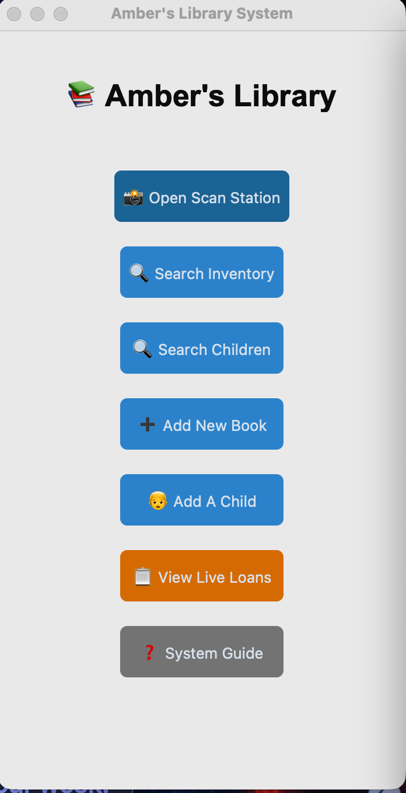
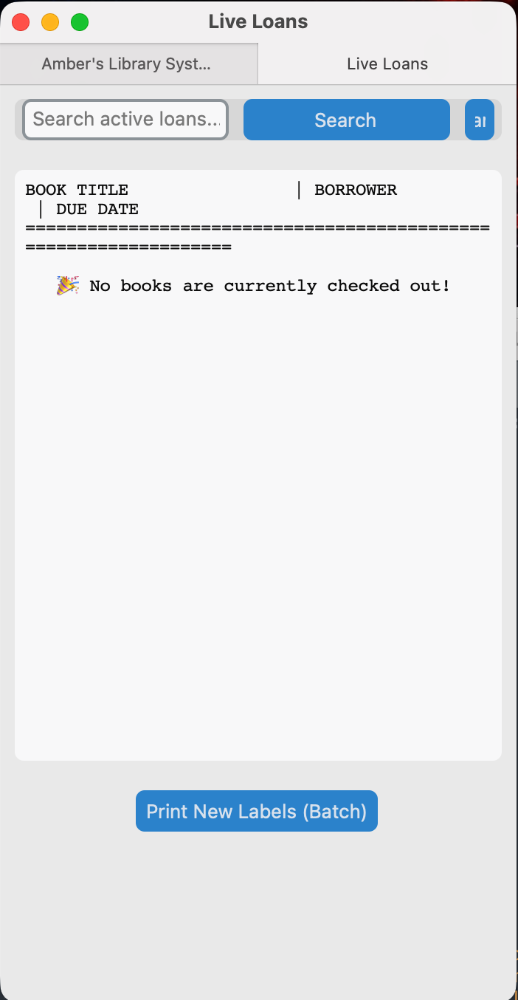

# Amber's Home Library System 📚
A bespoke library management application developed as a custom gift. This project combines a modern **CustomTkinter** interface with robust backend logic to digitize a home book collection and manage lending for children. This was wrote for Windows OS

## 🌟 Key Features
* **Custom Library Card Generation:** Automatically captures a "selfie" via webcam and generates a professional PDF library card with a unique QR code.
* **QR-Powered Scan Station:** A dedicated interface using **OpenCV** to scan member cards and book labels for instant checkouts and returns.
* **Automated Label Batching:** Includes logic to detect "new" books and generate 3x6 grid PDF labels (letter size) for easy printing and physical tagging.
* **The "One Book" Rule:** Integrated logic that enforces a strict checkout limit per child, ensuring the library stays organized.

## 🛠️ Technical Deep Dive
* **GUI Framework:** Built with `CustomTkinter` for a sleek, macOS-compatible dark mode aesthetic.
* **Computer Vision:** Implements `OpenCV` (`cv2`) for real-time QR code detection and camera feed rendering.
* **Database:** Uses `SQLite3` with relational tables for `books`, `members`, and `loans` to ensure data persistence.
* **Asset Creation:** Utilizes `ReportLab` for precision PDF drawing and `qrcode` for generating unique identifiers.

## 📸 Preview

### Main Dashboard

### The Scan Station

### Library Inventory

## ⚙️ Requirements
* **Python 3.12+**
* **Dependencies:** `customtkinter`, `opencv-python`, `pillow`, `qrcode`, `reportlab`
