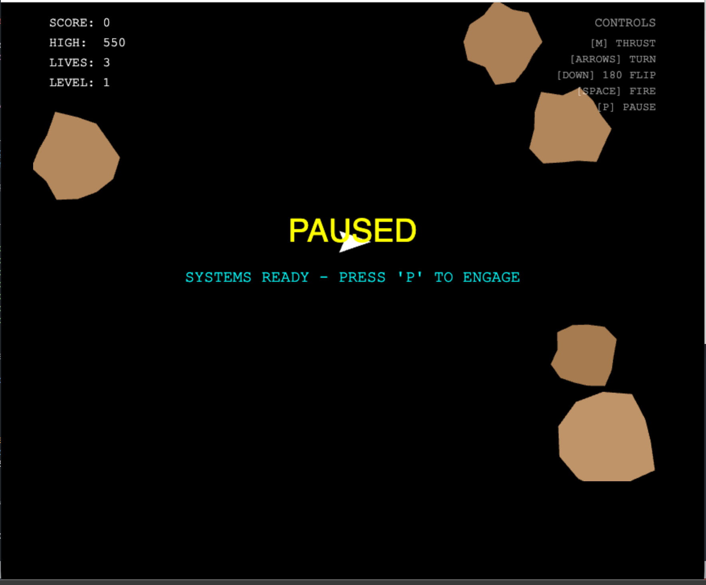
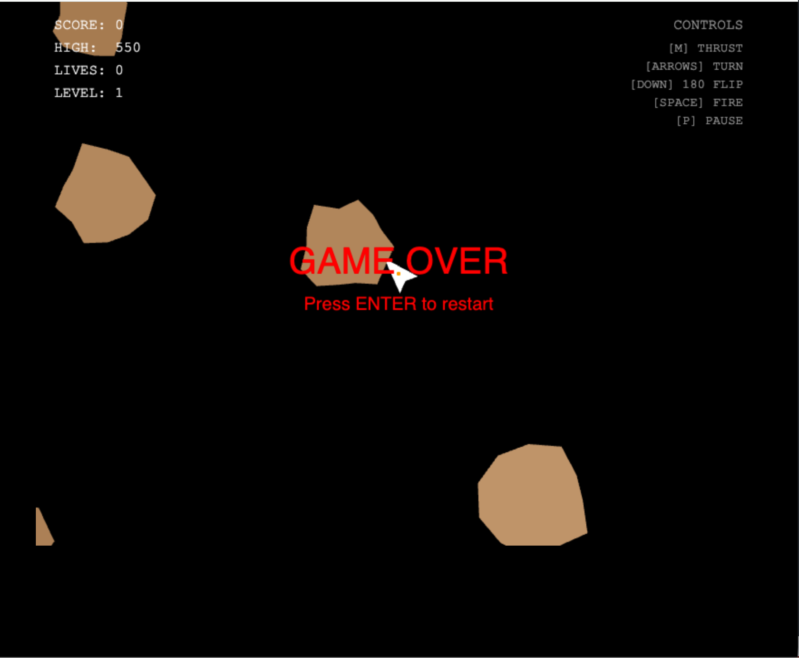

# 🚀 Asteroids: Ship PowerUps Edition

A polished, high-octane reimagining of the classic arcade shooter. Navigate through a dangerous asteroid field, collect powerful weapon upgrades, and deploy tactical shields and torpedoes to survive the cosmic chaos. Built from the ground up in Vanilla JavaScript. This version introduces a metallic-themed UI, an ergonomic control scheme, and dynamic ship upgrades, pulsating shield, plasma torpedoes, and none stop action.

## 🕹️ [Live Demo](https://grantruffner16301.github.io/GrantRuffner/Asteroid_JavaScript/)

---

## ✨ Features

### 🛠️ Combat Systems & Mechanics
* **Signature Tactical 180° Flip:** Execute instant redirection for high-speed "drift-shooting" maneuvers.
* **Dynamic Power-Up Engine:** Capture specialized orbs to override primary weapon systems:
    * **Spread:** Wide-area suppression fire.
    * **Double:** High-density parallel rounds.
    * **Pierce:** Kinetic slugs that travel through multiple targets.
    * **Ricochet:** Tracking projectiles that seek the nearest threat upon impact.
    * **Shield:** Protects your hull from collisions with a regenerating energy barrier.
* **Persistent High Scores:** Integrated local storage to track and save your all-time records.
* **Tactical Weaponry:** Deploy high-yield **Torpedoes** that clear large areas with a massive plasma blast.
* **Responsive Physics:** Experience smooth ship handling with momentum-based movement and screen-wrapping mechanics.
* **Procedural Visuals:** Features a shimmering starfield, screen-shake effects, and a metallic title interface.
* **Audio Immersion:** A full suite of sound effects for lasers, explosions, engine boosts, and game state changes.
* **MacBook Optimized:** Custom ergonomic control scheme designed specifically for modern laptop keyboards.

---

## 🎮 How to Play

| Action | Key |
| :--- | :--- |
| **Thrust (Engine)** | `V` |
| **Rotate Ship** | `Left / Right Arrows` |
| **Instant 180° Flip** | `R` |
| **Launch Torpedo** | `B` |
| **Fire Lasers** | `F` |
| **Pause / Resume** | `P` |
| **Restart Game** | `Enter` (on Game Over screen) |

---

## 🛠️ Technical Highlights
* **Zero Dependencies:** Written in 100% Vanilla JavaScript. No game engines or libraries (like Phaser or PixiJS) were used.
* **Canvas API:** Hand-coded rendering loop for high-performance vector-style graphics.
* **Custom Audio Engine:** Implemented a non-blocking audio trigger system to allow overlapping sound effects (explosions, lasers, and engine hum) without lag.

---

📦 **Installation**
1. Clone the repository:
 **bash**
   git clone https://github.com
Use code with caution.
2. Open index.html in any modern web browser.
3. Ensure the sounds/ directory is present to enable the full audio experience.

---

* **Created by Grant Ruffner**

---

## 📝 Development Story
This project started on an early rainy morning in Oil City as an experiment in re-optimizing classic game controls for modern hardware. The focus was on precision and "feel." I spent hours tuning the friction and thrust variables to ensure the ship didn't just move, but glided. 

The addition of the Power-Up system was the biggest challenge. It was an exercise in managing complex object states and collision physics. Ensuring that even when the screen is full of debris, the floating upgrades responded realistically to asteroid collisions (the "Bumping" logic) while maintaining a locked 60FPS. I specifically overhauled the control layout to a `V`/`R`/`F` and Right/Left key cluster to provide a more ergonomic experience for modern laptop players, reducing hand strain during high-level play.

---

## 📸 Gameplay

  
  

---

## 🚀 Deployment
This project is hosted via **GitHub Pages**. Every push to the `main` branch automatically updates the live environment, allowing for rapid iteration and testing.

---

## 🤝 Contributing
Feel free to fork this repo and add your own features, like new power-ups or enemy types!
