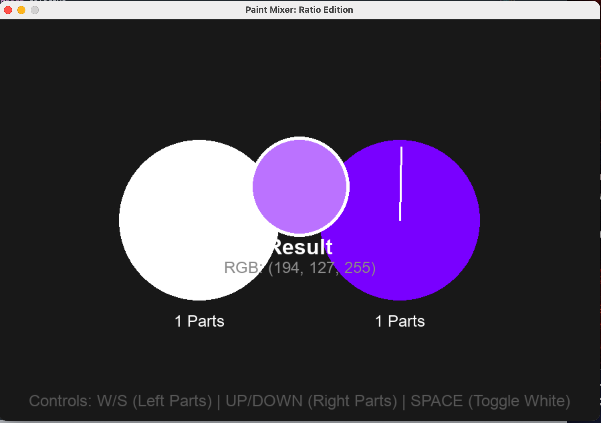
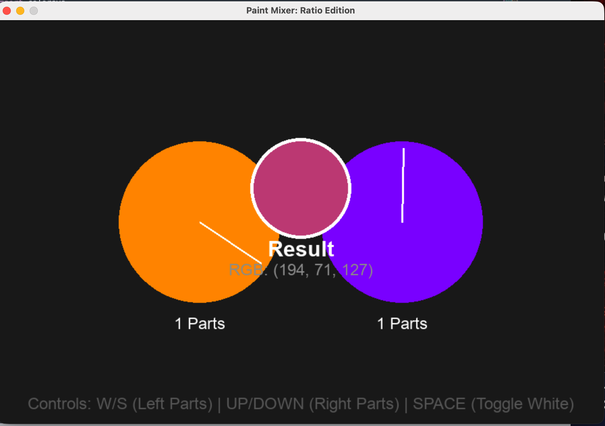

# 🎨 Paint Mixer: Ratio Edition

A dynamic, interactive **color mixing and ratio simulation tool** built with Python and Pygame. This application provides a visual, hands-on approach to understanding color theory, weighted averages, and color ratios by simulating physical paint mixing using the HSV and RGB color spaces.


---

## 📸 Screenshots

| Color Wheel & Ratio Selector | Dynamic Mix Result |
| :---: | :---: |
|  |  |

---

## ✨ Features

* **Dual Wheel Interaction:** Independently select two base colors by dragging around the custom HSV color wheels.
* **Weighted Mixing Algorithm:** Simulates proportional paint mixing using a precise weighted average formula:
  $$Result = \frac{(Color_1 \times Parts_1) + (Color_2 \times Parts_2)}{Total\ Parts}$$
* **Live Proportions & Toggles:** Adjust the "parts" (weights) of each color dynamically to see how shifting ratios impact the final hue.
* **Base Modifier Toggles:** Instantly switch either color wheel to pure white paint to simulate tints, highlights, and pigment dilution.
* **Real-Time Data Feedback:** Displays the precise output color inside a physical center container alongside its exact `RGB` values.

---

## 🛠️ Installation & Setup

### 1. Prerequisites
Ensure you have Python 3.x installed on your machine.

### 2. Clone the Repository
```bash
git clone [https://github.com/GrantRuffner16301/GrantRuffner.git](https://github.com/GrantRuffner16301/GrantRuffner.git)
cd GrantRuffner/Color_Wheel_Mixer
```
### 3. Install Dependencies
Install the required graphics library via pip:
```bash
pip install pygame
```

## 🚀 Controls & Usage
Run the program from your terminal:
```bash
python color_wheel.py
```

---

## Interactive Layout & Hotkeys:
  - 🖱️ Left Click & Drag: Rotate either the left or right wheel to pick your primary pigments.
  - ⌨️ Left Wheel Ratios: Press W to increase parts, S to decrease parts.
  - ⌨️ Right Wheel Ratios: Press UP ARROW to increase parts, DOWN ARROW to decrease parts.
  - ⌨️ Spacebar: Toggle the Right wheel to White Paint.
  - ⌨️ Left Shift: Toggle the Left wheel to White Paint.

---

## 📂 Architecture
The codebase handles everything within a clean, centralized event loop utilizing the following architectural building blocks:
  - HSV-to-RGB Map: Translates user angular selections smoothly into true digital color states via colorsys.
  - Proportional Vector Mix: Computes independent RGB channel scaling relative to user parts counters to generate the final blend.
  - Dynamic Blit Canvas: Redraws color indicator vectors, text fields, and geometric containers up to the engine's frame thresholds.

---

## 📝 License
This project is open-source. Feel free to modify, expand, or incorporate it into your own creative installations!
