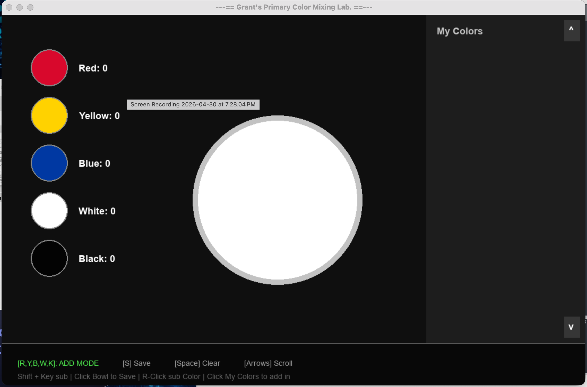
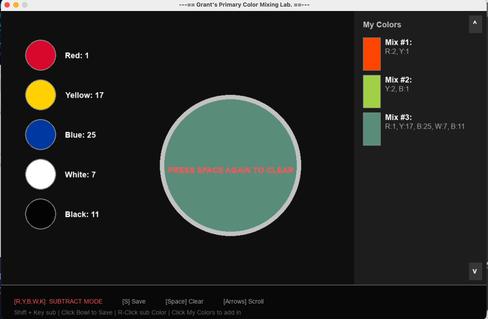

# 🎨 Grant's Primary Color Mixing Lab

A digital paint mixing and recipe simulation tool built with Python and Pygame. Unlike standard digital color pickers that use light-based additive mixing (RGB), this application utilizes a custom **RYB (Red-Yellow-Blue) to RGB subtractive translation algorithm** to realistically simulate physical pigment mixing, complete with black and white paint loaders for shades, tints, and pigment dilution.


---

## 📸 Screenshots

| Pigment Control & Mixing Bowl | Saved Color Recipes Palette |
| :---: | :---: |
|  |  |

---

## ✨ Features

* **Subtractive Fluid Paint Math:** Uses a custom `ryb_to_rgb` matrix to mimic real-world paint reactions when combining standard primary pigments.
* **Volume & Weight Scaling:** Dynamically scales RGB channel values relative to the total "parts" or volume of each individual pigment added to the mix.
* **Interactive Mixing Bowl:** Displays a massive live preview of your mixed paint directly in the center bucket with real-time text feedback.
* **Recipe Persistence:** Seamlessly saves and loads custom mixed colors locally using a structured `paint_recipes.json` payload.
* **Recipe Manager & Conflict Canvas:** Click the bowl to save a mix to your "My Colors" sidebar. Selecting an existing color gives you an overlay popup to choose between replacing your current active mix or adding the volumes together.
* **Scrollable Workspace:** Smooth vertical scrolling trackpad support and arrow hotkeys to view an infinite history of saved palette recipes.

---

## 🛠️ Installation & Setup

### 1. Prerequisites
Ensure you have Python 3.x installed on your machine.

### 2. Clone the Repository
```bash
git clone [https://github.com/GrantRuffner16301/GrantRuffner.git](https://github.com/GrantRuffner16301/GrantRuffner.git)
cd GrantRuffner/Paint_Color_Mixer
```
### 3. Install Dependencies
Install the Pygame engine via pip:
```bash
pip install pygame

---

## 🚀 Controls & Usage
Launch the laboratory interface from your terminal:
```bash
python paint_color_mixer.py
```
  - ### 🖱️ Mouse Bindings:
    - Left Click (Pigment Buckets): Add 1 part of Red, Yellow, Blue, White, or Black paint.
    - Right Click (Pigment Buckets): Subtract 1 part of a specific pigment.
    - Left Click (Center Bowl): Triggers the popup overlay to save your color recipe.
    - Left Click (My Colors Sidebar): Selects a saved recipe to Load/Inject.
    - Right Click (My Colors Sidebar): Deletes a saved recipe (requires a double right-click safety confirmation).

  - ### ⌨️ Keyboard Shortcuts:
    - R / Y / B / W / K: Press to instantly add 1 part of Red, Yellow, Blue, White, or BlacK.
    - Shift + Key: Subtracts 1 part of that designated pigment.
    - S: Save current active mix directly to your library.
    - Spacebar: Triggers a double-tap warning to completely clear the current mixing bowl.
    - Up / Down Arrows or Mouse Wheel: Scroll through your custom saved color palette feed.

---

## 📂 Architecture & Pipeline
The internal engine framework maps state updates through three independent blocks:
  - Subtractive Processing Model: Converts weighted ratios into temporary vector targets, adjusting luminance curves relative to White (tint) or Black (shade) steps.
  - Pygame Surface Blitting: Draws anti-aliased geometry loops, hover-highlight parameters, and target bounding boxes up to standard engine display refreshes.
  - JSON Local Serialization: Automatically updates paint_recipes.json upon saving a mix or cleanly exiting the Pygame system loop.

---

## 📝 License
This project is open-source. Feel free to modify, expand, or incorporate it into your own creative workflow!
