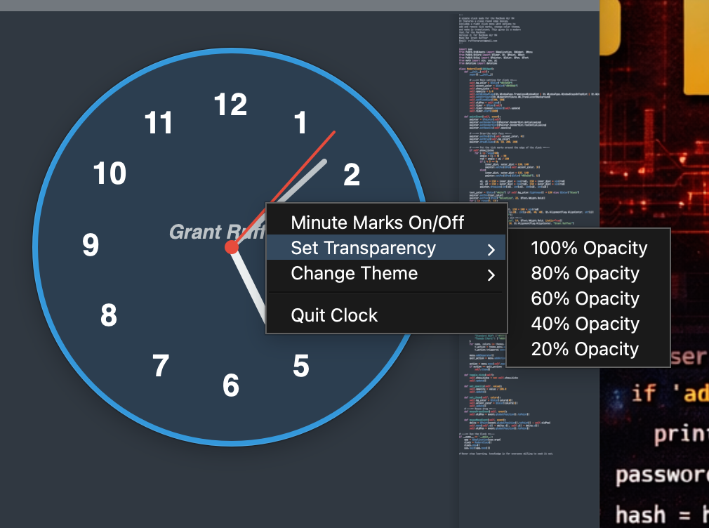
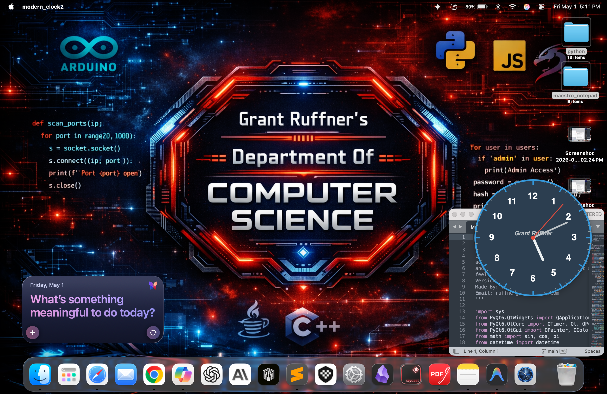

# Modern Analog Clock (macOS)
A sleek, customizable analog clock widget built with **Python** and **PyQt6**. This project demonstrates advanced GUI development, real-time math-based rendering, and system-level window manipulation.

## 🚀 Key Features
* **Adaptive Transparency:** Users can adjust opacity (20%–100%) via a custom context menu.
* **Dynamic Theming:** Includes multiple built-in themes like *Midnight Blue*, *Mahogany Wood*, and *Stealth Gray*.
* **Frameless Window:** Utilizes a frameless, "always-on-top" design for a clean desktop aesthetic.
* **Interactive UI:** Custom mouse-event handling allows the clock to be dragged and positioned anywhere on the screen.

## 🛠️ Technical Deep Dive
* **Geometric Rendering:** Uses `QPainter` with Trigonometric functions to calculate the precise hand positions based on system time.
* **Object-Oriented Design:** Built using a class-based structure to encapsulate theme data and UI state.
* **Event Handling:** Implemented `contextMenuEvent` for user interaction and `mouseMoveEvent` for window positioning.

## 📸 Preview

### Main Interface


### Customization & Themes


## ⚙️ Requirements & Setup
1. **Python 3.12+**
2. **PyQt6:** `pip install PyQt6`

**To Run:**
```bash
python modern_clock.py
